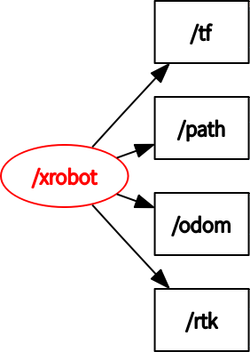

# README

用于从串口读取RTK消息，并发布为`ros`中的消息。

## 节点

节点名称：xrobot

发布的主题：

- odom(nav_msgs::Odometry)
里程计信息。
- path(nav_msgs::Path)
显示当先的经过的路径。
- tf
父坐标为odom，子坐标为rtk。用于转换rtk坐标系到标准坐标系。
- rtk
自定义消息，RTK原始数据。

节点图如下所示：



## 运行

通过以下指令来启动单独的节点：

```sh
rosrun xrobot xrobot_pose_node
```

通过以下指令使用启动文件运行：

```sh
roslaunch xrobot xrobot_driver.launch
```
